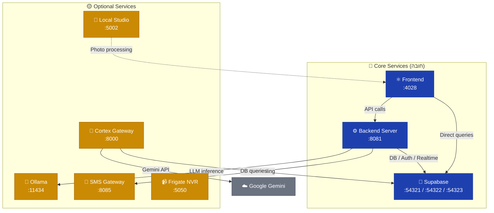

# ☕ iCaffeOS — Services Reference

> **Last Updated:** June 15, 2026  
> **Maintainer:** iCaffeOS Core Team  
> **מסמך זה מפרט את כל השירותים הנדרשים להפעלת המערכת המלאה.**

---

## Table of Contents

- [Architecture Overview](#architecture-overview)
- [Service Dependency Graph](#service-dependency-graph)
- [Network Ports Table](#network-ports-table)
- [Core Services](#core-services)
  - [1. 🐘 Supabase (Docker Compose)](#1--supabase-docker-compose)
  - [2. ⚙️ Backend Server (Node.js)](#2-️-backend-server-nodejs)
  - [3. ⚛️ Frontend (Vite Dev Server)](#3-️-frontend-vite-dev-server)
- [Optional Services](#optional-services)
  - [4. 🧠 Ollama (LLM Server)](#4--ollama-llm-server)
  - [5. 📸 Local Studio (Python/FastAPI)](#5--local-studio-pythonfastapi)
  - [6. 📱 SMS Gateway (Node.js)](#6--sms-gateway-nodejs)
  - [7. 📹 Frigate NVR (Docker)](#7--frigate-nvr-docker)
  - [8. 🧬 Cortex Gateway (Python/FastAPI)](#8--cortex-gateway-pythonfastapi)
- [Deprecated Services](#deprecated-services)
  - [9. 🪦 MCP Qwen Server (Node.js)](#9--mcp-qwen-server-nodejs)
- [Quick Start](#quick-start)
- [PM2 Ecosystem Config](#pm2-ecosystem-config)
- [Existing Startup Scripts](#existing-startup-scripts)
- [Health Check Commands](#health-check-commands)

---

## Architecture Overview

מערכת iCaffeOS מורכבת מ-stack מבוסס Supabase + Node.js + React, עם שירותי AI אופציונליים.
שלושת השירותים ה**חיוניים** להפעלה בסיסית הם: Supabase, Backend Server, ו-Frontend.
שאר השירותים אופציונליים ומוסיפים יכולות מתקדמות — Maya AI, עיבוד תמונות, SMS, מצלמות, ו-Knowledge Hub.

---

## Service Dependency Graph



---

## Network Ports Table

| Port | Service | Protocol | Required | Description |
|------|---------|----------|----------|-------------|
| **4028** | Frontend (Vite) | HTTP | ✅ Yes | React SPA — POS, KDS, Dashboard |
| **8081** | Backend Server | HTTP | ✅ Yes | API Proxy, Music, SMS Worker, Maya AI |
| **54321** | Supabase API Gateway (Kong) | HTTP | ✅ Yes | PostgREST, Auth, Storage, Realtime |
| **54322** | Supabase PostgreSQL | TCP | ✅ Yes | בסיס הנתונים הראשי |
| **54323** | Supabase Studio UI | HTTP | ⚠️ Dev | ממשק ניהול DB (לפיתוח בלבד) |
| **54324** | Supabase Mailpit | HTTP | ⚠️ Dev | לכידת מיילים לבדיקות |
| **54327** | Supabase Analytics | HTTP | ⚠️ Dev | Logflare analytics |
| **11434** | Ollama | HTTP | 🟡 Optional | LLM inference ל-Maya AI |
| **5002** | Local Studio | HTTP | 🟡 Optional | עיבוד תמונות מוצרים |
| **8085** | SMS Gateway | HTTP | 🟡 Optional | שליחת SMS דרך GlobalSMS |
| **5050** | Frigate NVR | HTTP | 🟡 Optional | NVR + זיהוי אובייקטים AI |
| **8000** | Cortex Gateway | HTTP | 🟡 Optional | Knowledge Hub — AI Chat |

---

## Core Services

### 1. 🐘 Supabase (Docker Compose)

> **הלב הפועם של המערכת** — בסיס נתונים, אימות, Edge Functions, ו-Realtime.

| Property | Value |
|----------|-------|
| **Ports** | `54321` (API), `54322` (PostgreSQL), `54323` (Studio), `54324` (Mailpit), `54327` (Analytics) |
| **Start** | `supabase start` or `docker compose -f docker-compose.supabase.yml up` |
| **Config** | [`frontend_source/docker-compose.supabase.yml`](frontend_source/docker-compose.supabase.yml) |
| **Status** | Currently running (~6 weeks uptime) |

**שירותי Supabase הפנימיים:**

- **Kong (API Gateway)** — `:54321` — שער כניסה ראשי ל-API, מנתב בקשות ל-PostgREST / Auth / Storage
- **PostgreSQL** — `:54322` — בסיס הנתונים הראשי, כולל כל טבלאות המערכת
- **Studio** — `:54323` — ממשק ויזואלי לניהול DB, שימושי מאוד בפיתוח
- **Mailpit** — `:54324` — לוכד מיילים (אימות, שחזור סיסמה) בסביבת dev
- **Analytics** — `:54327` — Logflare לניטור ביצועים

**בדיקת תקינות:**
```bash
curl http://localhost:54321/rest/v1/ -H "apikey: YOUR_ANON_KEY"
supabase status
```

---

### 2. ⚙️ Backend Server (Node.js)

> **שרת ה-API הראשי** — מתווך בין ה-Frontend ל-Supabase, מפעיל שירותי רקע.

| Property | Value |
|----------|-------|
| **Port** | `8081` |
| **Entry** | [`frontend_source/backend_server.js`](frontend_source/backend_server.js) |
| **Start** | `cd frontend_source && node backend_server.js` |
| **Dependencies** | Supabase (must be running), Ollama (optional, for Maya) |

**מודולים פנימיים:**

| Module | File | Description |
|--------|------|-------------|
| Maya AI | [`backend/services/mayaService.js`](backend/services/mayaService.js) | עוזרת AI מבוססת Ollama — צ'אט חכם למשתמשים |
| SMS Worker | [`backend/services/smsWorker.js`](backend/services/smsWorker.js) | תור SMS — שולח הודעות דרך GlobalSMS API |
| Music / Audio | [`backend/services/audioPlayer.js`](backend/services/audioPlayer.js) | מערכת מוזיקה מקומית ו-streaming |
| Drive Watcher | [`backend/services/driveWatcher.js`](backend/services/driveWatcher.js) | סנכרון קבצים עם Google Drive |
| Audit Service | [`backend/services/auditService.js`](backend/services/auditService.js) | רישום פעולות ובקרה |
| Cache Service | [`backend/services/cacheService.js`](backend/services/cacheService.js) | שכבת cache מקומית |
| Docker Watchdog | [`backend/services/dockerWatchdog.js`](backend/services/dockerWatchdog.js) | ניטור בריאות Docker containers |
| Secrets Service | [`backend/services/secretsService.js`](backend/services/secretsService.js) | ניהול מפתחות ו-credentials |

**בדיקת תקינות:**
```bash
curl http://localhost:8081/health
```

---

### 3. ⚛️ Frontend (Vite Dev Server)

> **ממשק המשתמש** — React SPA להזמנות (POS), מסך מטבח (KDS), ודשבורד ניהול.

| Property | Value |
|----------|-------|
| **Port** | `4028` |
| **Entry** | [`frontend_source/package.json`](frontend_source/package.json) → `npm run dev` |
| **Start** | `cd frontend_source && npm run dev` |
| **Vite Command** | `vite --host --port 4028` |
| **Dependencies** | Backend (`:8081`), Supabase (`:54321`) |

**הערות:**
- `--host` חושף את השרת לכל ממשקי הרשת — חשוב לטאבלטים ברשת המקומית
- בסביבת production, הקוד נבנה (`npm run build`) ומוגש דרך `vite preview`
- Proxy של SMS מוגדר גם דרך Vite middleware בסביבת dev

**בדיקת תקינות:**
```bash
curl -s -o /dev/null -w "%{http_code}" http://localhost:4028
```

---

## Optional Services

### 4. 🧠 Ollama (LLM Server)

> **מנוע AI מקומי** — מריץ מודלי שפה גדולים (LLM) על Apple Silicon.

| Property | Value |
|----------|-------|
| **Port** | `11434` |
| **Start** | `ollama serve` |
| **Required** | 🟡 רק אם משתמשים ב-Maya AI |

**Maya AI** היא עוזרת AI מובנית ב-iCaffeOS שמבוססת על Ollama.
ללא Ollama, שאר המערכת תעבוד בצורה תקינה — פשוט בלי פיצ'רים של AI chat.

**מודלים נדרשים:**
```bash
ollama pull qwen2.5:14b    # מודל ראשי ל-Maya
ollama list                # בדיקת מודלים מותקנים
```

**בדיקת תקינות:**
```bash
curl http://localhost:11434/api/tags
```

---

### 5. 📸 Local Studio (Python/FastAPI)

> **סטודיו תמונות** — הסרת רקע וקומפוזיציה אוטומטית לתמונות מוצרים בתפריט.

| Property | Value |
|----------|-------|
| **Port** | `5002` |
| **Entry** | [`backend/services/studio_local.py`](backend/services/studio_local.py) |
| **Start** | `python3 backend/services/studio_local.py` |
| **Required** | 🟡 רק לעריכת תמונות מוצרים |
| **Performance** | ~1 שנייה לתמונה על Apple Silicon (M4) |

**תלויות Python:**
```bash
pip install rembg pillow fastapi uvicorn
# or:
pip install -r backend/requirements.txt
```

**מה זה עושה:**
1. מקבל תמונת מוצר מעורך התפריט
2. מסיר רקע אוטומטית (`rembg`)
3. מרכיב תמונה נקייה על רקע סטודיו מקצועי (`PIL`)
4. מחזיר תמונה מוכנה לשימוש

**בדיקת תקינות:**
```bash
curl http://localhost:5002/health
```

---

### 6. 📱 SMS Gateway (Node.js)

> **שער SMS** — שליחת הודעות טקסט דרך GlobalSMS API.

| Property | Value |
|----------|-------|
| **Port** | `8085` |
| **Entry** | [`frontend_source/sms-server.js`](frontend_source/sms-server.js) |
| **Start** | `cd frontend_source && node sms-server.js` |
| **Required** | 🟡 אופציונלי — SMS גם עובר דרך Vite proxy ב-dev |

**הערה:** בסביבת פיתוח, SMS מנותב גם דרך ה-Vite dev server middleware.
שירות זה הוא standalone חלופי — שימושי ב-production או כשה-Vite dev server לא רץ.

---

### 7. 📹 Frigate NVR (Docker)

> **מערכת מצלמות** — NVR עם זיהוי אובייקטים מבוסס AI.

| Property | Value |
|----------|-------|
| **Port** | `5050` |
| **Start** | `docker start frigate` |
| **Required** | 🟡 רק לסניפים עם מצלמות אבטחה |

**הפעלה:**
```bash
docker start frigate        # start existing container
docker logs -f frigate      # follow logs
```

**בדיקת תקינות:**
```bash
curl http://localhost:5050/api/stats
```

---

### 8. 🧬 Cortex Gateway (Python/FastAPI)

> **Knowledge Hub** — AI chat מתקדם עם sanitization של PII, multi-tenant, ו-Gemini streaming.

| Property | Value |
|----------|-------|
| **Port** | `8000` |
| **Entry** | [`services/cortex-gateway/main.py`](services/cortex-gateway/main.py) |
| **Start** | `cd services/cortex-gateway && python3 main.py` |
| **Version** | 2.0.0 (Phase 3) |
| **Required** | 🟡 אופציונלי — Knowledge Hub |
| **Dependencies** | Supabase, Gemini API Key |

**Pipeline של בקשה:**
1. `Authenticate` — וולידציה של `X-Cortex-Tenant-ID`
2. `Sanitize` — מיסוך PII עם טוקנים חד-פעמיים
3. `Fetch` — שליפת הקשר עסקי (tenant-scoped)
4. `Build` — הרכבת system prompt רב-שכבתי
5. `Stream` — SSE streaming מ-Gemini
6. `Rehydrate` — שחזור PII אמיתי בתגובה
7. `Audit` — כתיבת log מטוקנז בלבד (ללא PII)
8. `Cleanup` — ניקוי מפת טוקנים מ-RAM

**הגדרת סביבה:**
```bash
cp services/cortex-gateway/.env.example services/cortex-gateway/.env
# Edit .env with:
#   GEMINI_API_KEY=...
#   SUPABASE_URL=http://localhost:54321
#   SUPABASE_SERVICE_ROLE_KEY=...
```

---

## Deprecated Services

### 9. 🪦 MCP Qwen Server (Node.js)

> ⚠️ **שירות זה ככל הנראה deprecated ואינו נדרש עוד.**

| Property | Value |
|----------|-------|
| **Entry** | [`mcp-qwen-server/server.js`](mcp-qwen-server/server.js) |
| **Purpose** | MCP protocol server for Qwen model |
| **Status** | ❌ Referenced in old `start_all_services.sh`, may no longer be needed |

שרת MCP ישן שהיה מיועד לתקשורת עם מודל Qwen. מופיע ב-script ההפעלה הישן
(`start_all_services.sh`) אבל ככל הנראה הוחלף על ידי Maya AI integration ישירה דרך
ה-Backend Server. **מומלץ לא להפעיל אלא אם יש צורך ספציפי.**

---

## Quick Start

### 🚀 סדר הפעלה מומלץ

השירותים תלויים אחד בשני — יש להפעיל לפי הסדר הבא:

```
Step 1 ──▶ Supabase         (כל השאר תלויים ב-DB)
Step 2 ──▶ Ollama           (אם צריך Maya AI)
Step 3 ──▶ Backend Server   (תלוי ב-Supabase + Ollama)
Step 4 ──▶ Frontend         (תלוי ב-Backend + Supabase)
Step 5 ──▶ Optional services (Studio, SMS, Frigate, Cortex)
```

### Minimal Start (3 שירותים בלבד)

```bash
# Terminal 1 — Supabase (if not already running)
cd frontend_source && supabase start

# Terminal 2 — Backend
cd frontend_source && node backend_server.js

# Terminal 3 — Frontend
cd frontend_source && npm run dev
```

### Full Start (כל השירותים)

```bash
# Terminal 1 — Supabase
cd frontend_source && supabase start

# Terminal 2 — Ollama
ollama serve

# Terminal 3 — Backend
cd frontend_source && node backend_server.js

# Terminal 4 — Frontend
cd frontend_source && npm run dev

# Terminal 5 — Local Studio (optional)
python3 backend/services/studio_local.py

# Terminal 6 — Cortex Gateway (optional)
cd services/cortex-gateway && python3 main.py
```

---

## PM2 Ecosystem Config

קובץ PM2 מומלץ לניהול כל השירותים — שמור כ-`ecosystem.config.cjs` בשורש הפרויקט:

```javascript
// ecosystem.config.cjs — iCaffeOS PM2 Configuration
module.exports = {
  apps: [
    // ── Core Services ──────────────────────────────────────
    {
      name: 'icaffe-backend',
      script: 'backend_server.js',
      cwd: './frontend_source',
      instances: 1,
      autorestart: true,
      watch: false,
      max_memory_restart: '512M',
      env: {
        NODE_ENV: 'production',
        PORT: 8081,
      },
    },
    {
      name: 'icaffe-frontend',
      script: 'npx',
      args: 'vite --host --port 4028',
      cwd: './frontend_source',
      instances: 1,
      autorestart: true,
      watch: false,
      env: {
        NODE_ENV: 'development',
      },
    },

    // ── Optional Services ──────────────────────────────────
    {
      name: 'icaffe-sms',
      script: 'sms-server.js',
      cwd: './frontend_source',
      instances: 1,
      autorestart: true,
      watch: false,
      env: {
        NODE_ENV: 'production',
        PORT: 8085,
      },
    },
    {
      name: 'icaffe-studio',
      script: 'backend/services/studio_local.py',
      interpreter: 'python3',
      instances: 1,
      autorestart: true,
      watch: false,
      env: {
        PORT: 5002,
      },
    },
    {
      name: 'icaffe-cortex',
      script: 'services/cortex-gateway/main.py',
      interpreter: 'python3',
      instances: 1,
      autorestart: true,
      watch: false,
      env: {
        PORT: 8000,
      },
    },
  ],
};
```

**שימוש:**
```bash
# Start all
pm2 start ecosystem.config.cjs

# Start only core
pm2 start ecosystem.config.cjs --only icaffe-backend,icaffe-frontend

# Monitor
pm2 monit

# Logs
pm2 logs

# Save & auto-start on boot
pm2 save
pm2 startup
```

> [!NOTE]
> Supabase ו-Ollama **לא מנוהלים דרך PM2** — Supabase רץ כ-Docker Compose
> ו-Ollama כ-system service. PM2 מנהל רק את שירותי ה-Node.js וה-Python.

---

## Existing Startup Scripts

### 📄 `start_all_services.sh` (Project Root)

**מיקום:** [`start_all_services.sh`](start_all_services.sh)

סקריפט הפעלה ישן יותר שמריץ: Ollama → MCP Qwen → Backend → Frontend (preview mode).
**מאפיינים:**
- משתמש ב-`nohup` לכל שירות
- בונה את ה-Frontend ומריץ `vite preview` (production mode)
- כולל הפעלת Electron (כרגע disabled)
- ⚠️ מריץ גם את MCP Qwen Server (ככל הנראה deprecated)

### 📄 `frontend_source/start-all-servers.sh`

**מיקום:** [`frontend_source/start-all-servers.sh`](frontend_source/start-all-servers.sh)

סקריפט הפעלה מודרני יותר עם UI צבעוני ובדיקות פורטים.
**מאפיינים:**
- בודק אם כל פורט כבר תפוס לפני הפעלה
- כולל: Ollama → Backend → SMS Gateway → Frigate → Frontend
- פותח את ה-Frontend ב-Terminal חדש (macOS `osascript`)
- כותב logs ל-`frontend_source/logs/`
- מציג סיכום צבעוני בסיום עם סטטוס כל שירות

---

## Health Check Commands

סקריפט מהיר לבדיקת סטטוס כל השירותים:

```bash
#!/bin/bash
echo "🔍 iCaffeOS Health Check"
echo "========================"

services=(
  "Supabase API:54321:/rest/v1/"
  "Backend:8081:/health"
  "Frontend:4028:/"
  "Ollama:11434:/api/tags"
  "Studio:5002:/health"
  "SMS Gateway:8085:/"
  "Frigate:5050:/api/stats"
  "Cortex:8000:/health"
)

for svc in "${services[@]}"; do
  IFS=':' read -r name port path <<< "$svc"
  status=$(curl -s -o /dev/null -w "%{http_code}" --max-time 2 "http://localhost:$port$path" 2>/dev/null)
  if [ "$status" = "200" ]; then
    echo "  ✅ $name (:$port) — Online"
  else
    echo "  ❌ $name (:$port) — Offline"
  fi
done
```

---

> [!TIP]
> **לפיתוח יום-יומי**, בדרך כלל מספיק להריץ רק Supabase + Backend + Frontend.
> שאר השירותים נדרשים רק כשעובדים על פיצ'רים ספציפיים (AI, תמונות, מצלמות).

---

<div align="center">

**iCaffeOS** — *Powering Israeli cafés with modern tech* ☕

</div>
